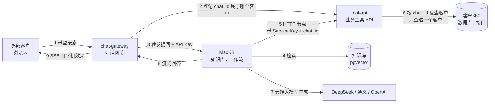

# 客服 Agent 接入客户360 · 架构方案

## 一、场景前提

| 项 | 结论 |
|---|---|
| 服务对象 | **外部客户**（不是内部坐席） |
| 能力要求 | 知识问答 **+ 查客户真实数据**（订单、工单、退款进度等） |
| 数据出口 | 数据**可以出内网**，因此可用云端大模型 |

这三条决定了两件事：

1. 可以直接用 DeepSeek / 通义 / OpenAI 等云端模型，**不必自建 GPU**，成本和上线速度都大幅优化；
2. 因为面向外部客户且要查真实数据，**越权是本项目的头号风险**，架构必须围绕它设计。

## 二、为什么不能只用 MaxKB 自带的「嵌入第三方」

「嵌入第三方」是 MaxKB 内置功能（应用/智能体概览页 → 嵌入第三方 → 全屏 / 浮窗 / 移动端代码），
配套的域名白名单、提问频率限制、知识来源展示也都是内置的，零代码。

但它生成的是一个**公开可访问的对话入口，识别不出当前登录的是哪个客户**。
用它做纯知识问答没问题；一旦要回答「我的退款到哪了」，就必须由你们的后端带着登录态去调用 MaxKB。

因此本方案的结论是：

- **知识问答部分** → 可以用自带嵌入，快速上线；
- **查数据部分** → 必须走下面的网关方案。

两者可以并存，也可以统一走网关（推荐，体验一致、口径统一）。

## 三、整体架构

## 四、安全核心：customer_id 怎么来的

**一句话规则：customer_id 只能由网关从登录态推导，绝不经过前端，也绝不经过大模型。**

具体做法：

1. 客户在客户360 登录，前端调网关 `POST /api/chat/sessions`，只带登录态，**不带 customer_id**；
2. 网关校验登录态得到 `customer_id`，向 MaxKB 打开会话拿到 `chat_id`；
3. 网关调用 `tool-api` 的 `/internal/bind`，登记「`chat_id` → `customer_id`」；
4. MaxKB 工作流查数据时，HTTP 节点只带上自己的 `chat_id` 和 Service Key；
5. `tool-api` 用 `chat_id` 反查客户身份，**所有 SQL 都以 customer_id 为过滤条件**。

于是：

- 大模型**不知道**任何 customer_id，无法编造一个去查别人；
- 客户即使伪造别人的 `conversation_id`，网关也会因为归属不符直接 403；
- 即使猜到别人的订单号，`tool-api` 也会因为 `customer_id + order_no` 双条件返回 404
  （刻意不区分「不存在」和「不属于你」，防止被拿来枚举）。

`scripts/smoke_test.sh` 就是专门验证这几条的，每次改动后都应该跑一遍。

## 五、其他防护

| 风险 | 措施 | 代码位置 |
|---|---|---|
| API Key 泄露 | Key 只存在于网关服务端，前端只认识网关 | `chat-gateway/app/config.py` |
| 敏感信息出境 | 出站数据脱敏（手机号/证件号/银行卡/邮箱） | `tool-api/app/masking.py` |
| 客户自己输入敏感信息 | 提问送模型前先掩码 | `chat-gateway/app/safety.py` |
| 恶意刷量 | 按客户维度限流 + 单次提问长度上限 | `chat-gateway/app/safety.py` |
| 工具 API 被直接调用 | 强制 `X-Service-Key`，且只在内网监听 | `tool-api/app/security.py` |
| 幻觉 | 提示词强制「只依据知识库」+ 开启知识来源展示 | MaxKB 应用配置 |
| 事后追责 | 提问/回答/转人工全量审计日志 | `chat-gateway/app/audit.py` |
| AI 误改数据 | 默认只读，写操作仅「建工单」一个，单独授权 | `tool-api/app/main.py` |

## 六、多副本部署前必须替换的两处

演示代码为了能直接跑起来，用了进程内内存存储，**多副本会出问题**：

- `tool-api/app/store.py` 的会话绑定表 → 换 Redis（文件里已给出实现骨架）；
- `chat-gateway/app/sessions.py` 的会话归属表、`safety.py` 的限流器 → 同样换 Redis。

## 七、许可证提醒

MaxKB 采用 **GPLv3**。本方案只通过 HTTP API 调用 MaxKB、不修改其源码，属于低风险用法；
如果后续要 fork 改造并对外分发，需要评估开源义务。另外 SSO、系统级 API 等属于企业版 X-Pack（收费）。
建议在选择「二次开发」路线前先过法务。
